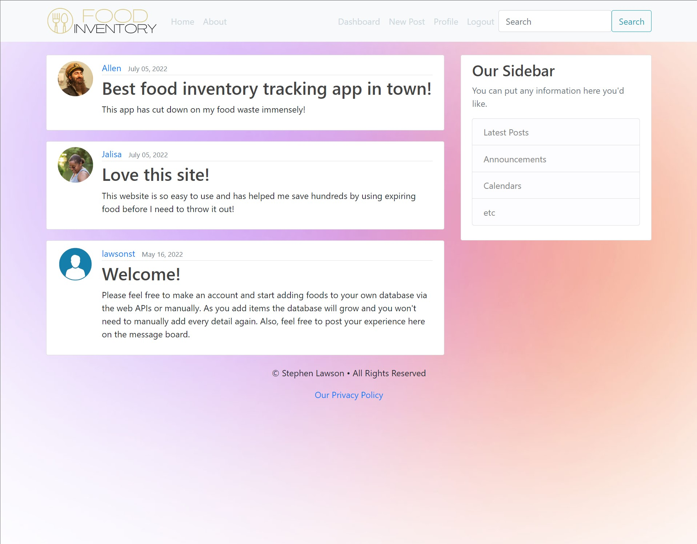
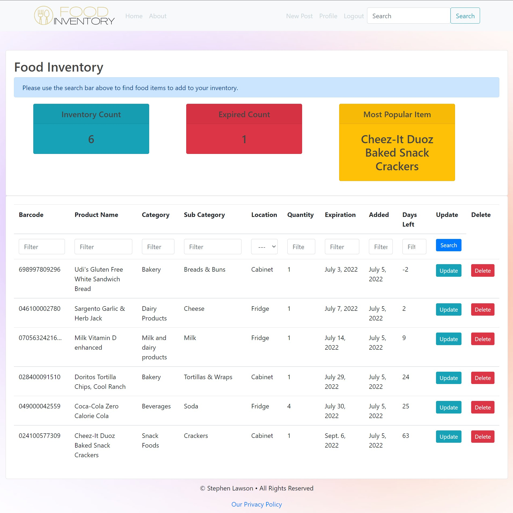
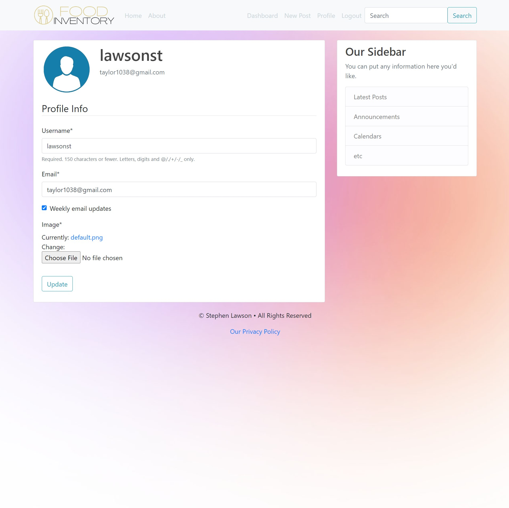
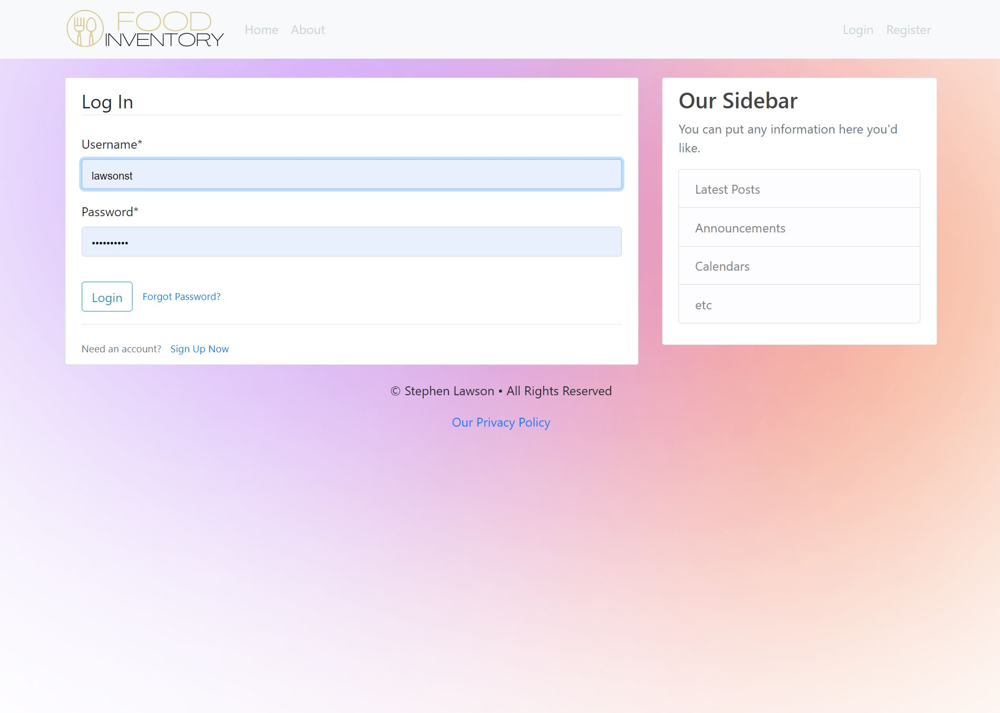

# Food Inventory Application

This was created with the hope of reducing food waste and saving users hundreds of dollars a year. 

## Table of contents

- [Overview](#overview)
  - [The challenge](#the-challenge)
  - [Screenshots](#screenshot)
  - [Links](#links)
- [My process](#my-process)
  - [Built with](#built-with)
  - [What I learned](#what-i-learned)
  - [Continued development](#continued-development)
- [Author](#author)

## Overview

### The challenge

Create a dynamic and easy to use website where users can easily lookup their food item and be reminded when it is close to expiring

### Screenshots

### Links

- Solution URL: [Food Inventory App](https://www.foodinventory.app/)

## My process

The project utilizes Linode to serve webpages, AWS S3 buckets to serve static and images, and AWS RDS to maintain the MySQL database. The HTML and CSS both utilize Bootstrap4 for a simple frontend and a dynamic layout. The backend is handled by Django for organizing models, templates, routing, URLs, and admin functionality. A barcode search API was implemented to easily populate forms with descriptive information rather than user provided data. Users are also able to maintain profiles with their own usernames, hashed passwords, databases of food items, posts, and profile photos. Recorded emails are used to send weekly expiration updates, this functionally can be opted out of if the user wishes to. The email address is also initially verified along with the use of reCAPTCHA on user profile generation, to reduce spam accounts and improve security. 

### Built with

- AWS S3 Buckets
- AWS RDS
- Linode Ubuntu Server
- MySQL
- Django
- Desktop-first workflow

**Note: These are just examples. Delete this note and replace the list above with your own choices**

### What I learned

I learned a lot about the Django web framework and initializing and maintaining a Linux server for this application. There was also a lot I learned about AWS and the many serves it has to offer. Bootstrap was also a big help in making the templating much easier.

### Continued development

I will continue to work on implementing new features, improving the style of the website, maintaining the server, and making the barcode search API more robust.

## Author

- Website - [Portfolio Site](https://www.stephen.photography/portfolio)

